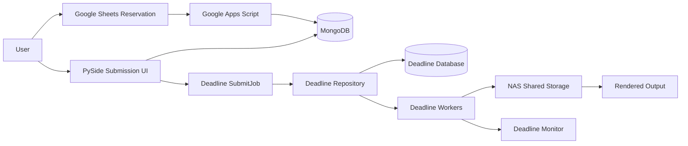

# Deadline Render Farm Automation System

[](https://github.com/kangseyoung/deadline-renderfarm-automation/actions/workflows/portfolio-check.yml)

Deadline Render Farm Automation System is a graduation project focused on render-farm infrastructure, render submission automation, and lab-scale operation. It connects a PySide-based submission UI, MongoDB reservation/auth data, NAS shared-path policy, and Deadline job submission for Maya/Arnold and Blender workflows.

On-premise Deadline render farm automation with PySide UI, MongoDB reservation/auth, Deadline job submission, NAS workflow, and troubleshooting documentation.

This repository is the public portfolio snapshot. Private infrastructure values, raw logs, credentials, license details, unredacted screenshots, and original internal notes are intentionally excluded or redacted.

## Main Code Review Guide

The main portfolio source code is organized under `src/`.

`src/` is a public portfolio snapshot for interviewer code review. It is not a replacement for the original runtime source tree. The original development snapshot is kept under `gpclean/` for project history and to avoid breaking existing imports or runtime behavior.

| Area | Path | Description |
|---|---|---|
| Public Source Snapshot | `src/` | Reorganized code review snapshot for interviewers |
| Login / Submission UI | `src/ui/` | PySide-based login, file drop, and render submission UI |
| Deadline Submission | `src/submission/` | Builds Deadline job/plugin info files and submits render jobs through `deadlinecommand SubmitJob` |
| Reservation / Auth | `src/reservation/` | MongoDB-based reservation, authentication, and status data access |
| Config | `src/config/` | Environment-based configuration placeholders |
| Flow Entry Point | `src/main.py` | Review-friendly entry point that summarizes the end-to-end system flow |
| Original Development Tree | `gpclean/` | Original project structure kept for history |

> Note: `src/` is a public portfolio snapshot reorganized for code review.  
> The original development structure is preserved under `gpclean/`.

## My Contributions

- Designed and documented a public-safe render submission flow from PySide UI to Deadline `SubmitJob`.
- Implemented/reorganized Deadline `job_info` and `plugin_info` generation logic for Maya/Arnold and Blender workflows.
- Connected the submission flow with MongoDB-based reservation/auth data handling.
- Documented operation and troubleshooting cases around Worker status, NAS path policy, MongoDB reservation/auth, license/path issues, and render-farm usage.
- Prepared a redacted public portfolio snapshot by separating reviewable source code from private infrastructure values.

## Portfolio Baseline

- **Portfolio branch:** `main`
- **What to review:** this README, `src/`, `docs/architecture.md`, `docs/troubleshooting.md`, and `docs/implementation.md`
- **Recommended review target:** `src/`, `docs/architecture.md`, `docs/troubleshooting.md`, and `gpclean/` for original development history.
- **Branch note:** older `master`, `backup`, `final`, and experiment branches are kept only as development history unless stated otherwise. See [docs/branch-guide.md](docs/branch-guide.md).

## Project Focus

This is not only a VFX tool. The main work was designing and validating a practical render-farm automation flow for a shared computer lab:

- Deadline Repository / Database / Worker based render-farm structure
- NAS shared-path policy for scene input and render output
- MayaBatch/Arnold and Blender render submission flow
- PySide login and submission UI wiring
- MongoDB-backed reservation/auth/status data handling
- Deadline `SubmitJob` command integration
- Worker, license, OCIO, NAS, and path troubleshooting documentation

## Implemented in This Repository

- **Deadline job submission package:** `gpclean/gpclean_submit/`
  - Builds Deadline `job_info` and `plugin_info` files.
  - Calls `deadlinecommand SubmitJob`.
  - Supports MayaBatch and Blender plugin info generation.
  - Provides DCC adapters for Maya and Blender scene/render metadata.
- **PySide UI flow:** `gpclean/ui/`
  - Login UI and submission UI structure.
  - File drop / scene context flow.
  - Submission button path connected to the Deadline submission layer.
- **MongoDB integration:** `gpclean/backend/authDB/`
  - Auth and reservation collection access through environment-configured MongoDB.
  - Google Sheets reservation sync script using a private service-account path from environment variables.
- **Infrastructure documentation:**
  - Architecture, operation, troubleshooting, security cleanup, branch guide, and public-safe project timelog.
- **Public-safe technical paper:**
  - Redacted paper is available at [docs/technical_paper_redacted.pdf](docs/technical_paper_redacted.pdf).

## Implemented / Documented Outside the Public Snapshot

Some deployment pieces are documented from the final project but are not published as raw source because they contain private infrastructure details:

- Full Deadline Repository/Database server configuration
- Private Google Apps Script project
- Raw Deadline logs and benchmark logs
- Real NAS paths, machine names, IP addresses, license server values, and account data
- Unredacted screenshots and original internal notes

## Planned Improvements

- Replace older duplicated Blender-side package code with one shared package layout.
- Expand current public-safe smoke tests into deeper unit tests for `job_info` / `plugin_info` generation.
- Add a safer CLI wrapper for local validation before calling `deadlinecommand`.
- Improve status polling from Deadline/MongoDB into the UI.
- Add sanitized example screenshots after redaction review.

## Architecture



Detailed architecture is documented in [docs/architecture.md](docs/architecture.md).

## Tech Stack

- **Language/UI:** Python, PySide6/PySide2
- **Render management:** AWS Thinkbox Deadline 10
- **DCC/rendering:** MayaBatch, Arnold, Blender
- **Data:** MongoDB, Google Sheets API
- **Automation:** Deadline command-line submission, Google Apps Script workflow documentation
- **Storage/infra:** NAS shared storage, UNC path policy, Windows lab PCs

## Results

The final technical paper reports evaluation on 20 Worker PCs:

- Single-PC render time for a 240-frame scene: about 9h 10m
- 20-Worker render-farm completion time: about 26-32m
- Reported improvement: about 17-20x for the tested scene

Sanitized raw benchmark logs are not included in this public repository.

## Repository Structure

```text
.
├── src/                        # Public portfolio source snapshot for code review
│   ├── app_entry/              # Copied original app entry point for reference
│   ├── ui/                     # PySide login, file-drop, and submission UI
│   ├── submission/             # Deadline job/plugin info and SubmitJob logic
│   ├── reservation/            # MongoDB auth/reservation access
│   ├── config/                 # Environment placeholder settings
│   ├── main.py                 # Review-friendly flow entry point
│   └── README.md
├── gpclean/                    # Main Python source snapshot
│   ├── gpclean_submit/         # Deadline submission package
│   ├── ui/                     # Login, file-drop, and submission UI
│   └── backend/authDB/         # MongoDB/auth/reservation scripts
├── blender/gpclean/            # Older Blender-oriented duplicated package tree
├── docs/                       # Public documentation
│   ├── architecture.md
│   ├── branch-guide.md
│   ├── security-cleanup.md
│   ├── troubleshooting.md
│   ├── project-timelog.md
│   ├── project-timelog-ko.md
│   └── technical_paper_redacted.pdf
├── diagrams/                   # Mermaid architecture/workflow sources
├── screenshots/                # Redacted public screenshots
│   └── renderfarm-usage-guide/ # Render farm usage guide screenshots
├── .env.example                # Placeholder-only environment template
└── README_ko.md                # Korean README
```

## Configuration

Copy `.env.example` to a private `.env` file and replace placeholders locally. Do not commit `.env`, credentials, service-account JSON files, license files, real server paths, IP addresses, or screenshots containing infrastructure values.

Important environment variables include:

- `MONGODB_URI`
- `DEADLINE_COMMAND`
- `DEADLINE_REPOSITORY`
- `NAS_ROOT`
- `GOOGLE_SERVICE_ACCOUNT_JSON`
- `ARNOLD_LICENSE_SERVER`
- `OCIO_CONFIG`

## Security Notes

This repository previously contained or referenced sensitive development artifacts during the project history. Any exposed password, token, credential file, account, IP address, or license value must be considered compromised and replaced. Current public files use placeholders where infrastructure values are needed.

See [docs/security-cleanup.md](docs/security-cleanup.md) and [docs/security-notes.md](docs/security-notes.md).

## Documentation

- [Architecture](docs/architecture.md)
- [Operations Runbook](docs/operations-runbook.md)
- [Troubleshooting](docs/troubleshooting.md)
- [Branch Guide](docs/branch-guide.md)
- [Security Cleanup](docs/security-cleanup.md)
- [Project Timelog](docs/project-timelog.md)
- [Korean Project Timelog](docs/project-timelog-ko.md)
- [Project Presentation](https://docs.google.com/presentation/d/1aXf-YSAMTUuJI3glqOqilKSjnw-s2l35VXsNBPf0UpQ/edit?usp=sharing)
- [Render Farm Usage Guide Screenshots](screenshots/renderfarm-usage-guide/)

## AI Usage

AI was used as a development and documentation assistant. I defined the system requirements, render-farm workflow, VFX/lab constraints, and public-safe documentation scope, then reviewed and revised AI-assisted suggestions against the actual project context.
