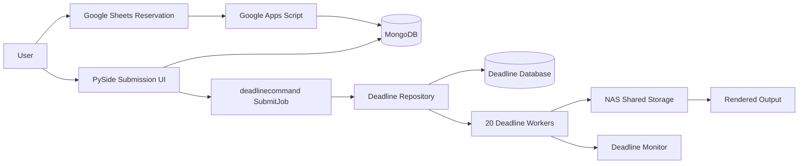

# Deadline Render Farm Automation System

Phoenix Render Farm System is a Deadline-based render farm automation project for a shared computer lab. It combines render infrastructure, a PySide submission UI, MongoDB-backed user and reservation data, Google Sheets reservation operations, NAS shared storage policy, and DCC-specific Maya/Arnold and Blender submission flows.

This repository contains the public-safe source snapshot and documentation for the capstone project. Some deployment scripts and raw operational logs are excluded or redacted for security.

In the final evaluation reported in the technical paper, a 240-frame scene that took about **9h 10m on a single PC** completed in about **26-32m on 20 Deadline Workers**.

## Overview

The project addresses a VFX pipeline problem: many users need to render large Maya or Blender scenes on a fixed pool of lab machines, but manual rendering causes path errors, license conflicts, unfair machine usage, and repeated setup work after lab PCs reset.

This repository contains public documentation plus a source snapshot of the submission-side tooling. A redacted public version of the technical paper is available at [docs/technical_paper_redacted.pdf](docs/technical_paper_redacted.pdf).

## Problem

Before the system, rendering depended heavily on individual PC setup and manual coordination.

- Scene files and assets were not always available through a consistent shared path.
- MayaBatch and Arnold jobs could fail when paths, OCIO settings, or license variables differed by machine.
- Reservation and usage control were handled outside the render submission workflow.
- Operators had to diagnose Worker, NAS, Deadline, and DCC failures manually.

## Solution

The final system was designed and documented as an infrastructure automation workflow:

- Deadline Repository, Database, and Worker model for distributed rendering.
- 20 Worker PCs configured for parallel frame processing, documented in the technical paper.
- NAS-backed shared storage with a UNC path policy for scene input and render output.
- PySide-based UI for login, scene context, and render submission flow.
- MongoDB collections for authentication and reservation/status data.
- Google Sheets / Google Apps Script reservation process for shared lab scheduling, documented in the technical paper.
- Deadline command submission support for MayaBatch/Arnold and Blender jobs.
- Operational troubleshooting process for license, OCIO, NAS, Worker, and path failures.

The public source snapshot includes the PySide/MongoDB/Deadline submission-side code. It does not include the private Apps Script project, raw Deadline logs, full Deadline Repository configuration, or private deployment scripts.

## System Architecture



This diagram represents the designed/deployed system described in the technical paper. Not every deployment component is present as source code in this public snapshot. See [docs/architecture.md](docs/architecture.md) and the Mermaid sources in [diagrams/](diagrams/).

## Tech Stack

- Render management: AWS Thinkbox Deadline 10.4
- DCC/rendering: MayaBatch, Arnold, Blender
- UI: Python, PySide6 with PySide2 fallback in code
- Data: MongoDB, pymongo
- Reservation operations: Google Sheets, Google Apps Script, Google Sheets API. Apps Script is documented in the paper, but not included as public source.
- Storage: NAS shared storage with UNC path policy
- Platform: Windows lab PCs with Deep Freeze constraints

## Key Features

- Reservation-first render farm workflow.
- MongoDB-backed login and reservation lookup.
- Deadline job/plugin info generation for MayaBatch and Blender.
- DCC adapters for gathering scene file, frame range, renderer, version, output path, and camera data.
- Preflight checks for scene path and frame range.
- Operational patterns for Worker status checks, Deadline log review, and error recording.
- Public documentation that redacts infrastructure identifiers and credentials.

## Results

The final paper reports evaluation on 20 Worker PCs:

- Single-PC render time for a 240-frame scene: about 9h 10m.
- 20-Worker render farm completion time: about 26-32m.
- Reported overall improvement: about 17-20x in total completion time for the tested scene.

The performance result is reported from the final technical paper; sanitized raw benchmark logs are not included in this public snapshot. Reproducing the exact numbers therefore needs verification from redacted benchmark artifacts.

## Repository Structure

```text
.
├── gpclean/                    # Main Python package
│   ├── main.py                 # PySide UI launch path
│   ├── ui/                     # Login, submitter, file-drop UI
│   ├── backend/authDB/         # MongoDB auth/reservation scripts
│   └── gpclean_submit/         # Deadline submission package
├── blender/gpclean/            # Blender-oriented duplicated package tree
├── ShaderMain.py               # Maya shader helper script
├── ShaderSetup.py              # Maya shader helper implementation
├── userSetup.py                # DCC startup hook
├── docs/                       # Public documentation
│   ├── project-timelog.md      # Sanitized graduation-project time log
│   └── technical_paper_redacted.pdf
├── diagrams/                   # Mermaid architecture/workflow sources
└── screenshots/                # Placeholder guidance for future redacted screenshots
```

## Troubleshooting Highlights

Common production failure points were documented around:

- MongoDB connectivity or bind/firewall issues.
- Deadline Repository or shared path access failure.
- Offline Workers or misconfigured Worker permissions.
- Arnold license environment failure.
- OCIO configuration errors in MayaBatch.
- NAS/UNC path mismatches.
- User scene/output path mistakes.

See [docs/troubleshooting.md](docs/troubleshooting.md).

## Security Notes

This public repo must not include real IP addresses, NAS paths, license servers, MongoDB URIs, Google Sheet URLs, passwords, API keys, student IDs, private account names, or internal server names. Public docs use placeholders such as `<nas-server-ip>`, `<license-server-ip>`, `<mongodb-uri>`, `<google-sheet-url>`, `<student-id>`, `<internal-path>`, `<internal-server-name>`, `<private-account>`, and `<secret>`.

See [docs/security-notes.md](docs/security-notes.md).

## Paper

The redacted public technical paper is included at [docs/technical_paper_redacted.pdf](docs/technical_paper_redacted.pdf). Private source material, raw logs, credentials, account details, infrastructure identifiers, and unredacted paper copies must remain outside this repository.

The sanitized graduation-project time log is available at [docs/project-timelog.md](docs/project-timelog.md).

## AI Usage

AI was used as a development assistant during the documentation and implementation process, not as a replacement for project ownership. I defined the project requirements, VFX pipeline constraints, Deadline render-farm workflow, and public-safe documentation scope, then reviewed and revised AI-assisted suggestions to match the actual system.

In this project, AI helped with:

- Organizing the initial architecture ideas for the Deadline, PySide, MongoDB, Google Sheets, NAS, Maya/Arnold, and Blender workflow.
- Drafting and refining documentation structure for the public portfolio version while keeping private infrastructure details redacted.
- Reviewing repetitive Python implementation patterns around DCC adapters, job/plugin info generation, path handling, and preflight checks.
- Analyzing error categories from Deadline, MayaBatch, Arnold license setup, OCIO, NAS paths, and Worker configuration to build a clearer troubleshooting guide.
- Checking refactoring directions and validation checklists for the render submission workflow.

All final README content and code-level claims were checked against the repository source snapshot, public documentation, and private project context before being included.
