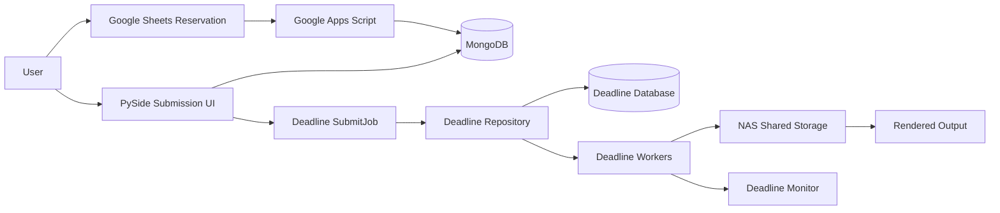

# Deadline Render Farm Automation System

[](https://github.com/kangseyoung/deadline-renderfarm-automation/actions/workflows/portfolio-check.yml)

Deadline Render Farm Automation System은 졸업 프로젝트로 진행한 온프레미스 렌더팜 자동화 프로젝트입니다. PySide 기반 제출 UI, MongoDB 기반 예약/인증 데이터, NAS 공유 경로 정책, AWS Thinkbox Deadline 제출 흐름을 연결해 Maya/Arnold와 Blender 렌더 작업을 실습실 환경에서 사용할 수 있도록 구성했습니다.

이 저장소는 공개 포트폴리오용 스냅샷입니다. 실제 인프라 값, 원본 로그, 계정 정보, 라이선스 정보, 내부 경로, 민감한 스크린샷은 제외하거나 placeholder로 대체했습니다.

## Main Code Review Guide

면접관이 먼저 보면 좋은 핵심 코드는 `src/` 아래에 정리되어 있습니다.

`src/`는 코드 리뷰를 쉽게 하기 위해 재구성한 public portfolio snapshot입니다. 원본 실행 구조를 대체하는 폴더가 아니며, 기존 개발 구조는 import와 실행 흐름을 보존하기 위해 `gpclean/` 아래에 유지되어 있습니다.

| Area | Path | Description |
|---|---|---|
| Public Source Snapshot | `src/` | 면접/포트폴리오 코드 리뷰용으로 재구성한 핵심 코드 |
| Login / Submission UI | `src/ui/` | PySide 기반 로그인, 파일 드롭, 렌더 제출 UI |
| Deadline Submission | `src/submission/` | Deadline `job_info` / `plugin_info` 생성 및 `deadlinecommand SubmitJob` 호출 흐름 |
| Reservation / Auth | `src/reservation/` | MongoDB 기반 예약, 인증, 상태 데이터 접근 |
| Config | `src/config/` | 환경변수 기반 placeholder 설정 |
| Flow Entry Point | `src/main.py` | 전체 시스템 흐름을 보여주는 리뷰용 entry point |
| Original Development Tree | `gpclean/` | 프로젝트 히스토리와 원본 실행 구조 보존 |

> Note: `src/`는 코드 리뷰용 public portfolio snapshot입니다.  
> 원본 개발 구조는 `gpclean/` 아래에 보존되어 있습니다.

## My Contributions

- PySide UI에서 Deadline `SubmitJob`까지 이어지는 렌더 제출 흐름을 설계하고 문서화했습니다.
- Maya/Arnold와 Blender 워크플로우를 위한 Deadline `job_info` / `plugin_info` 생성 로직을 구현하고 공개 리뷰용 구조로 정리했습니다.
- MongoDB 기반 예약/인증 데이터와 렌더 제출 흐름을 연결했습니다.
- Worker 상태, NAS 경로 정책, MongoDB 예약/인증, 라이선스/경로 문제 등 운영 중 발생할 수 있는 이슈를 troubleshooting 문서로 정리했습니다.
- 공개 포트폴리오에 맞게 민감한 인프라 값을 제거하고 리뷰 가능한 코드와 문서를 분리했습니다.

## Portfolio Baseline

- **Portfolio branch:** `main`
- **먼저 볼 위치:** `README.md`, `README_ko.md`, `src/`, `docs/architecture.md`, `docs/troubleshooting.md`, `docs/operations-runbook.md`
- **추천 리뷰 대상:** `src/`, `docs/architecture.md`, `docs/troubleshooting.md`, `gpclean/`
- **브랜치 안내:** 예전 `master`, `backup`, `final` 계열 브랜치는 개발 히스토리 용도입니다. 자세한 내용은 [docs/branch-guide.md](docs/branch-guide.md)를 참고하면 됩니다.

## Project Focus

이 프로젝트는 단순한 VFX 도구가 아니라, 공유 실습실 환경에서 사용할 수 있는 렌더팜 운영 자동화 흐름을 직접 구성하고 검증한 프로젝트입니다.

- Deadline Repository / Database / Worker 기반 렌더팜 구조
- NAS 공유 경로 기반의 입력/출력 파일 정책
- MayaBatch/Arnold 및 Blender 렌더 제출 흐름
- PySide 기반 로그인 및 제출 UI
- MongoDB 기반 예약/인증/상태 데이터 처리
- Deadline `SubmitJob` 명령 연동
- Worker, 라이선스, OCIO, NAS, 경로 문제에 대한 운영 및 장애 대응 문서화

## Implemented in This Repository

- **Deadline job submission package:** `gpclean/gpclean_submit/`
  - Deadline `job_info`와 `plugin_info` 파일 생성
  - `deadlinecommand SubmitJob` 호출
  - MayaBatch와 Blender plugin info 생성 지원
  - DCC별 장면 파일, 프레임 범위, 렌더러, 출력 경로 메타데이터 처리
- **PySide UI flow:** `gpclean/ui/`
  - 로그인 UI와 제출 UI 구조
  - 파일 드롭과 장면 컨텍스트 전달 흐름
  - 제출 버튼에서 Deadline 제출 레이어로 이어지는 흐름
- **MongoDB integration:** `gpclean/backend/authDB/`
  - 환경변수 기반 MongoDB 접근
  - 예약/인증 컬렉션 접근 로직
- **Public source snapshot:** `src/`
  - 면접관이 핵심 코드를 빠르게 확인할 수 있도록 UI, 제출, 예약/인증, 설정 영역을 분리
- **Documentation:**
  - 아키텍처, 운영 런북, troubleshooting, 보안 정리, 브랜치 가이드, 공개용 프로젝트 타임로그

## Implemented / Documented Outside the Public Snapshot

아래 항목은 최종 프로젝트에서 다뤘거나 문서화했지만, 민감정보가 포함될 수 있어 공개 원본은 포함하지 않습니다.

- 전체 Deadline Repository / Database 서버 설정
- 비공개 Google Apps Script 프로젝트
- 원본 Deadline 로그와 benchmark 로그
- 실제 NAS 경로, 장비명, IP 주소, 라이선스 서버 값, 계정 데이터
- redaction 처리되지 않은 스크린샷과 내부 노트

## Public-Safe Tests and CI

이 저장소에는 외부 Deadline, MongoDB, NAS, Maya, Blender 없이 실행 가능한 공개용 smoke test가 포함되어 있습니다.

- `tests/test_public_snapshot.py`
  - `src/`, `.env.example`, 주요 문서 파일 존재 여부 확인
  - `src/main.py`, `src/submission/`, `src/reservation/`의 Python 파일을 import하지 않고 `ast.parse()`로 문법 검사
- `.github/workflows/portfolio-check.yml`
  - push / pull request 시 Python 3.11에서 pytest 실행
  - 공개 문서와 source snapshot에 숫자 IP가 들어갔는지 간단 점검
  - workflow 파일 자체의 정규식이 false positive로 잡히지 않도록 `.github` 폴더는 IP grep 대상에서 제외

## Planned Improvements

- 오래된 Blender 쪽 중복 package tree를 공통 package 구조로 정리
- 현재 public-safe smoke test를 `job_info` / `plugin_info` 생성 로직에 대한 더 깊은 unit test로 확장
- `deadlinecommand` 호출 전 로컬 검증을 위한 안전한 CLI wrapper 추가
- UI에서 Deadline/MongoDB 상태 추적 개선
- redaction 검토가 끝난 예시 스크린샷 추가

## Architecture



자세한 구조는 [docs/architecture.md](docs/architecture.md)에 정리되어 있습니다.

## Tech Stack

- **Language/UI:** Python, PySide6/PySide2
- **Render management:** AWS Thinkbox Deadline 10
- **DCC/rendering:** MayaBatch, Arnold, Blender
- **Data:** MongoDB, Google Sheets API
- **Automation:** Deadline command-line submission, Google Apps Script workflow documentation
- **Storage/infra:** NAS shared storage, UNC path policy, Windows lab PCs
- **Quality check:** pytest 기반 public-safe smoke test, GitHub Actions

## Results

최종 기술 논문에서는 20대 Worker PC 기반 평가 결과를 보고했습니다.

- 240프레임 장면의 단일 PC 렌더 시간: 약 9h 10m
- 20-Worker 렌더팜 완료 시간: 약 26-32m
- 테스트 장면 기준 전체 완료 시간 약 17-20x 개선

공개 저장소에는 redaction되지 않은 원본 benchmark 로그를 포함하지 않습니다.

## Repository Structure

```text
.
|-- src/                         # Public portfolio source snapshot for code review
|   |-- app_entry/               # Copied original app entry point for reference
|   |-- ui/                      # PySide login, file-drop, and submission UI
|   |-- submission/              # Deadline job/plugin info and SubmitJob logic
|   |-- reservation/             # MongoDB auth/reservation access
|   |-- config/                  # Environment placeholder settings
|   |-- main.py                  # Review-friendly flow entry point
|   `-- README.md
|-- gpclean/                     # Original development source tree
|   |-- gpclean_submit/          # Deadline submission package
|   |-- ui/                      # Login, file-drop, and submission UI
|   `-- backend/authDB/          # MongoDB/auth/reservation scripts
|-- blender/gpclean/             # Older Blender-oriented duplicated package tree
|-- docs/                        # Public documentation
|   |-- architecture.md
|   |-- operations-runbook.md
|   |-- troubleshooting.md
|   |-- branch-guide.md
|   |-- security-cleanup.md
|   |-- project-timelog.md
|   `-- project-timelog-ko.md
|-- tests/                       # Public-safe smoke tests
|-- .github/workflows/           # GitHub Actions workflow
|-- diagrams/                    # Mermaid architecture/workflow sources
|-- screenshots/                 # Redacted public screenshots
|-- .env.example                 # Placeholder-only environment template
|-- README.md                    # English README
`-- README_ko.md                 # Korean README
```

## Configuration

`.env.example`을 개인 로컬 `.env` 파일로 복사한 뒤 placeholder를 로컬 환경에 맞게 바꿔 사용합니다. `.env`, credential, service-account JSON, 라이선스 파일, 실제 서버 경로, IP 주소, 내부 정보가 포함된 스크린샷은 절대 커밋하지 않습니다.

주요 환경변수 예시는 다음과 같습니다.

- `MONGODB_URI`
- `DEADLINE_COMMAND`
- `DEADLINE_REPOSITORY`
- `NAS_ROOT`
- `GOOGLE_SERVICE_ACCOUNT_JSON`
- `ARNOLD_LICENSE_SERVER`
- `OCIO_CONFIG`

## Operations and Troubleshooting

운영 관점의 점검 흐름은 [docs/operations-runbook.md](docs/operations-runbook.md)에 정리했습니다.

주요 troubleshooting 범위는 다음과 같습니다.

- MongoDB 연결 또는 bind/firewall 문제
- Deadline Repository 또는 공유 경로 접근 실패
- Worker offline 상태 또는 잘못된 Worker 설정
- Arnold 라이선스 환경 문제
- MayaBatch/OCIO 설정 오류
- NAS/UNC 경로 불일치
- 사용자 입력 또는 출력 경로 오류

자세한 내용은 [docs/troubleshooting.md](docs/troubleshooting.md)를 참고하면 됩니다.

## Security Notes

이 공개 저장소에는 실제 IP 주소, NAS 경로, 라이선스 서버, MongoDB URI, Google Sheet URL, 비밀번호, API key, student ID, private account name, internal server name을 포함하지 않습니다.

공개 문서와 예시는 `<nas-server-ip>`, `<license-server-ip>`, `<mongodb-uri>`, `<google-sheet-url>`, `<student-id>`, `<internal-path>`, `<internal-server-name>`, `<private-account>`, `<secret>` 같은 placeholder를 사용합니다.

자세한 내용은 [docs/security-cleanup.md](docs/security-cleanup.md)와 [docs/security-notes.md](docs/security-notes.md)를 참고하면 됩니다.

## Documentation

- [Architecture](docs/architecture.md)
- [Operations Runbook](docs/operations-runbook.md)
- [Troubleshooting](docs/troubleshooting.md)
- [Branch Guide](docs/branch-guide.md)
- [Security Cleanup](docs/security-cleanup.md)
- [Project Timelog](docs/project-timelog.md)
- [Korean Project Timelog](docs/project-timelog-ko.md)
- [Project Presentation](https://docs.google.com/presentation/d/1aXf-YSAMTUuJI3glqOqilKSjnw-s2l35VXsNBPf0UpQ/edit?usp=sharing)
- [Render Farm Usage Guide Screenshots](screenshots/renderfarm-usage-guide/)

## AI Usage

AI는 개발 및 문서화 보조 도구로 사용했습니다. 시스템 요구사항, 렌더팜 운영 흐름, VFX/실습실 제약, 공개 문서 범위는 직접 정의했고, AI가 제안한 내용은 실제 프로젝트 맥락과 코드 기준으로 검토하고 수정했습니다.
