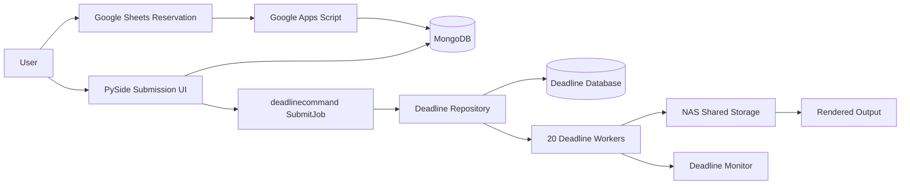

# Deadline 기반 렌더팜 자동화 시스템

Phoenix Render Farm System은 공유 컴퓨터 실습실 환경을 위한 Deadline 기반 렌더팜 자동화 프로젝트입니다. 렌더 인프라, PySide 제출 UI, MongoDB 기반 사용자 및 예약 데이터, Google Sheets 예약 운영, NAS 공유 스토리지 정책, 그리고 DCC별 Maya/Arnold 및 Blender 제출 흐름을 통합합니다.

이 저장소는 캡스톤 프로젝트의 공개용 안전 소스 스냅샷과 문서를 포함합니다. 보안을 위해 일부 배포 스크립트와 원본 운영 로그는 제외되었거나 redaction 처리되었습니다.

기술 논문에 보고된 최종 평가에서는, 단일 PC에서 약 **9h 10m**이 걸리던 240프레임 씬이 **20대 Deadline Worker**를 사용해 약 **26-32m**에 완료되었습니다.

## Overview

이 프로젝트는 VFX 파이프라인 문제를 다룹니다. 여러 사용자가 고정된 실습실 장비 풀에서 대형 Maya 또는 Blender 씬을 렌더링해야 하지만, 수동 렌더링은 경로 오류, 라이선스 충돌, 불공정한 장비 사용, 실습실 PC 초기화 이후 반복적인 설정 작업을 유발합니다.

이 저장소에는 공개 문서와 제출 측 도구의 소스 스냅샷이 포함되어 있습니다. redaction 처리한 공개용 기술 논문은 [docs/technical_paper_redacted.pdf](docs/technical_paper_redacted.pdf)에서 확인할 수 있습니다.

## Problem

이 시스템 이전에는 렌더링이 개별 PC 설정과 수동 조율에 크게 의존했습니다.

- 씬 파일과 에셋이 항상 일관된 공유 경로를 통해 제공되지 않았습니다.
- 장비마다 경로, OCIO 설정, 라이선스 변수가 달라 MayaBatch 및 Arnold 작업이 실패할 수 있었습니다.
- 예약과 사용 제어가 렌더 제출 워크플로우 밖에서 처리되었습니다.
- 학생들이 실습실에 과밀되어 병목현상이 발생하였습니다.

## Solution

최종 시스템은 인프라 자동화 워크플로우로 설계되고 문서화되었습니다.

- 분산 렌더링을 위한 Deadline Repository, Database, Worker 모델.
- 병렬 프레임 처리를 위해 구성된 20대 Worker PC. 이 내용은 기술 논문에 문서화되어 있습니다.
- 씬 입력과 렌더 출력에 대한 UNC 경로 정책을 적용한 NAS 기반 공유 스토리지.
- 로그인, 씬 컨텍스트, 렌더 제출 흐름을 위한 PySide 기반 UI.
- 인증 및 예약/상태 데이터를 위한 MongoDB 컬렉션.
- 공유 실습실 스케줄링을 위한 Google Sheets / Google Apps Script 예약 프로세스. 이 내용은 기술 논문에 문서화되어 있습니다.
- MayaBatch/Arnold 및 Blender 작업을 위한 Deadline command 제출 지원.
- 라이선스, OCIO, NAS, Worker, 경로 장애를 위한 운영 트러블슈팅 프로세스.

공개 소스 스냅샷에는 PySide/MongoDB/Deadline 제출 측 코드가 포함되어 있습니다. 비공개 Apps Script 프로젝트, 원본 Deadline 로그, 전체 Deadline Repository 설정, 비공개 배포 스크립트는 포함되어 있지 않습니다.

## System Architecture



이 다이어그램은 기술 논문에 설명된 설계/배포 시스템을 나타냅니다. 모든 배포 구성요소가 이 공개 스냅샷에 소스 코드로 포함되어 있는 것은 아닙니다. 자세한 내용은 [docs/architecture.md](docs/architecture.md)와 [diagrams/](diagrams/)의 Mermaid 소스를 참고하세요.

## Tech Stack

- Render management: AWS Thinkbox Deadline 10.4
- DCC/rendering: MayaBatch, Arnold, Blender
- UI: Python, PySide6 with PySide2 fallback in code
- Data: MongoDB, pymongo
- Reservation operations: Google Sheets, Google Apps Script, Google Sheets API. Apps Script는 논문에 문서화되어 있지만 공개 소스로는 포함되어 있지 않습니다.
- Storage: NAS shared storage with UNC path policy
- Platform: Windows lab PCs with Deep Freeze constraints

## Key Features

- 예약 우선 렌더팜 워크플로우.
- MongoDB 기반 로그인 및 예약 조회.
- MayaBatch 및 Blender를 위한 Deadline job/plugin info 생성.
- 씬 파일, 프레임 범위, 렌더러, 버전, 출력 경로, 카메라 데이터를 수집하는 DCC 어댑터.
- 씬 경로와 프레임 범위에 대한 preflight 검사.
- Worker 상태 확인, Deadline 로그 리뷰, 오류 기록을 위한 운영 패턴.
- 인프라 식별자와 자격 증명을 redaction 처리한 공개 문서.

## Results

최종 논문은 20대 Worker PC에서의 평가 결과를 보고합니다.

- 240프레임 씬의 단일 PC 렌더 시간: 약 9h 10m.
- 20-Worker 렌더팜 완료 시간: 약 26-32m.
- 보고된 전체 개선 폭: 테스트 씬의 총 완료 시간 기준 약 17-20x.

이 성능 결과는 최종 기술 논문에서 보고된 내용입니다. Sanitized raw benchmark log는 이 공개 스냅샷에 포함되어 있지 않습니다. 따라서 정확한 수치를 재현하려면 redaction된 벤치마크 산출물을 통한 검증이 필요합니다.

## Repository Structure

```text
.
├── gpclean/                    # Main Python package
│   ├── main.py                 # PySide UI launch path
│   ├── ui/                     # Login, submitter, file-drop UI
│   ├── backend/authDB/         # MongoDB auth/reservation scripts
│   └── gpclean_submit/         # Deadline submission package
├── blender/gpclean/            # Blender-oriented duplicated package tree
├── ShaderMain.py               # Maya shader helper script
├── ShaderSetup.py              # Maya shader helper implementation
├── userSetup.py                # DCC startup hook
├── docs/                       # Public documentation
├── diagrams/                   # Mermaid architecture/workflow sources
└── screenshots/                # Placeholder guidance for future redacted screenshots
```

## Troubleshooting Highlights

일반적인 운영 장애 지점은 다음 범주로 문서화되었습니다.

- MongoDB 연결 또는 bind/firewall 문제.
- Deadline Repository 또는 공유 경로 접근 실패.
- 오프라인 Worker 또는 잘못 구성된 Worker 권한.
- Arnold 라이선스 환경 문제.
- MayaBatch의 OCIO 설정 오류.
- NAS/UNC 경로 불일치.
- 사용자 씬/출력 경로 오류.

자세한 내용은 [docs/troubleshooting.md](docs/troubleshooting.md)를 참고하세요.

## Security Notes

이 공개 저장소에는 실제 IP 주소, NAS 경로, 라이선스 서버, MongoDB URI, Google Sheet URL, 비밀번호, API 키, student ID, private account name, internal server name이 포함되면 안 됩니다. 공개 문서는 `<nas-server-ip>`, `<license-server-ip>`, `<mongodb-uri>`, `<google-sheet-url>`, `<student-id>`, `<internal-path>`, `<internal-server-name>`, `<private-account>`, `<secret>` 같은 placeholder를 사용합니다.

자세한 내용은 [docs/security-notes.md](docs/security-notes.md)를 참고하세요.

## AI 활용 방식

이 프로젝트에서는 AI를 단순 코드 생성 도구가 아니라 개발 보조 도구로 활용했습니다. 프로젝트 요구사항, VFX 파이프라인 제약, Deadline 기반 렌더팜 흐름, 공개 문서화 범위는 직접 정의했고, AI가 제안한 내용은 실제 코드와 프로젝트 맥락에 맞게 검토하고 수정했습니다.

AI는 다음 작업을 정리하는 데 도움을 주었습니다.

- Deadline, PySide, MongoDB, Google Sheets, NAS, Maya/Arnold, Blender로 이어지는 시스템 구조 아이디어 정리
- 공개 포트폴리오용 README와 문서 구조 초안 작성 및 보안 정보 redaction 기준 검토
- DCC 어댑터, Deadline job/plugin info 생성, 경로 처리, preflight check 등 반복적인 Python 구현 패턴 검토
- Deadline Worker, MayaBatch, Arnold 라이선스, OCIO, NAS 경로 문제와 같은 오류 유형 분석 및 디버깅 방향 정리
- 렌더 제출 워크플로의 리팩토링 방향과 검증 체크리스트 작성

최종 문서와 코드 설명은 저장소의 공개 소스, 문서, 실제 프로젝트 맥락을 기준으로 직접 확인한 뒤 반영했습니다.

## Paper

redaction 처리한 공개용 기술 논문은 [docs/technical_paper_redacted.pdf](docs/technical_paper_redacted.pdf)에 포함되어 있습니다. 비공개 원본 자료, 원본 로그, 자격 증명, 계정 정보, 인프라 식별자, redaction되지 않은 논문 원본은 이 저장소 밖에서 관리해야 합니다.
