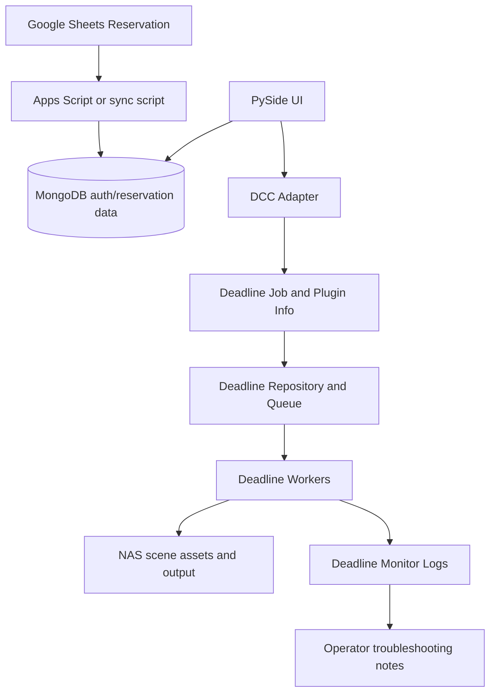

# Architecture

This document describes the public, sanitized architecture for the Phoenix Render Farm System / Deadline Render Farm Automation System. Final system claims come from the final technical paper. Implementation details are marked separately when they are visible in the final branch code.

The architecture diagrams and workflows represent the designed/deployed system described in the technical paper. They are not a guarantee that every deployment script, cloud document, or operational log is present in this public source snapshot.

## Overall System

The designed system is built around a reservation-first render farm workflow:

1. A user reserves a render time slot through Google Sheets.
2. Google Apps Script and/or synchronization scripts update reservation data.
3. The PySide UI authenticates the user and reads reservation data from MongoDB.
4. The UI or submission module builds Deadline job/plugin info.
5. `deadlinecommand SubmitJob` submits the render job to Deadline.
6. Deadline Workers render frames from NAS-shared project data.
7. Render output is written back to NAS shared storage.
8. Users and operators monitor job status in Deadline Monitor.

## Deadline Repository / Database / Worker Structure

The final paper describes a Deadline Repository / Database / Worker deployment:

- Repository: shared Deadline configuration, plugins, scripts, job metadata, and Worker configuration.
- Deadline Database: MongoDB-backed Deadline state for jobs, tasks, and Workers.
- Workers: 20 lab PCs used for distributed frame rendering.
- Monitor: operator and user-facing Deadline status view.

The paper also states that the UI MongoDB and Deadline MongoDB were separated for stability. The final branch code shows UI-side MongoDB access, but the Deadline database configuration itself is not included in this repository, so the exact production split needs verification from sanitized deployment records.

## NAS and UNC Path Policy

Render farm jobs require every Worker to read the same scene and asset paths. The final paper describes a NAS policy based on UNC paths and standardized folders:

- input scenes and source project data under a shared NAS input area.
- rendered output under a shared NAS output area.
- cache/project data organized consistently so MayaBatch and Blender Workers resolve the same assets.

Public examples should use placeholders:

```text
\\<nas-server-ip>\<internal-path>\input\<student-id>\<date>
\\<nas-server-ip>\<internal-path>\output\<student-id>\<date>
```

Implementation note: `gpclean/gpclean_submit/core/paths.py` currently normalizes slashes, but it does not fully enforce a UNC policy. Full production UNC validation therefore needs verification.

## PySide UI Role

The PySide UI is the user-facing submission layer. In the final branch it appears under:

- `gpclean/main.py`
- `gpclean/ui/login/`
- `gpclean/ui/main/`
- `gpclean/ui/file_drop/`

The UI responsibilities are:

- launch a Qt application inside or outside a DCC context.
- authenticate users through MongoDB.
- show current scene/file context.
- show reserved time slots.
- gather or trigger render submission data.

The paper describes the UI as reducing user mistakes through guided path and setting controls. Some UI-to-submission wiring in the final branch needs verification, especially the button path that calls the submission controller without required arguments.

## MongoDB Role

MongoDB is used for user and reservation/status data:

- `auth_collection`: login records with password hashes.
- `reservation`: reservation time slots by user or group.
- job/status collections are described by the paper, but the final branch does not include a complete job-status schema.

The public configuration should use `<mongodb-uri>`, never real connection strings.

## Google Sheets / GAS Role

The final paper describes Google Sheets and Google Apps Script as the reservation interface. The reservation system manages shared lab access and helps prevent overlapping usage.

The final branch includes `gpclean/backend/authDB/sheetToMongo.py`, which reads Google Sheets through Python packages and writes reservation records to MongoDB. The actual Apps Script source is not present in the branch, so GAS implementation details need verification.

## Maya / Arnold and Blender Batch Rendering Flow

The final branch includes a structured submission package under `gpclean/gpclean_submit/`:

- `cli.py`: dispatches by DCC.
- `dcc/maya_adapter.py`: gathers Maya scene, workspace, renderer, frame range, camera, and render layer data; validates Arnold/mtoa when needed.
- `dcc/blender_adapter.py`: gathers Blender scene, output, renderer, frame range, and version data.
- `core/job_builder.py`: builds Deadline job info and plugin info for MayaBatch or Blender.
- `core/deadline.py`: writes temporary info files and invokes `deadlinecommand SubmitJob`.

Maya/Arnold depends on correct mtoa loading, Arnold license environment variables, OCIO configuration, and NAS path availability. Blender depends on accessible scene/output paths and Deadline Blender plugin configuration.

## Data Flow



## Considered but Not Adopted

The final paper states that Docker and Ansible were evaluated but not adopted for the final lab deployment.

- Docker was considered for packaging Worker environments, but Autodesk/Maya/Arnold licensing, GUI/DCC behavior, GPU access, Deep Freeze resets, and network drive mounting made it unsuitable.
- Ansible was considered for Worker setup automation, but Windows SSH/WinRM restrictions, Deep Freeze resets, and inconsistent lab permissions made it unreliable.

The adopted architecture used native Windows Worker setup with Deadline, shared storage, environment scripts, and operational checklists.
