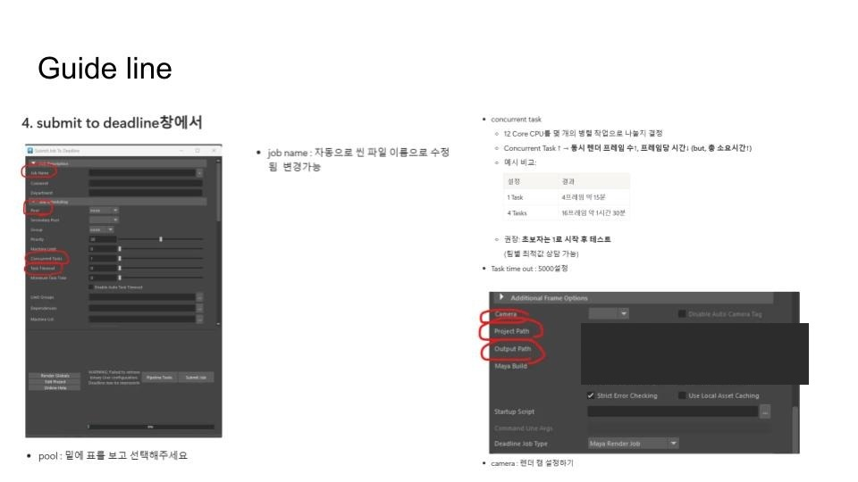
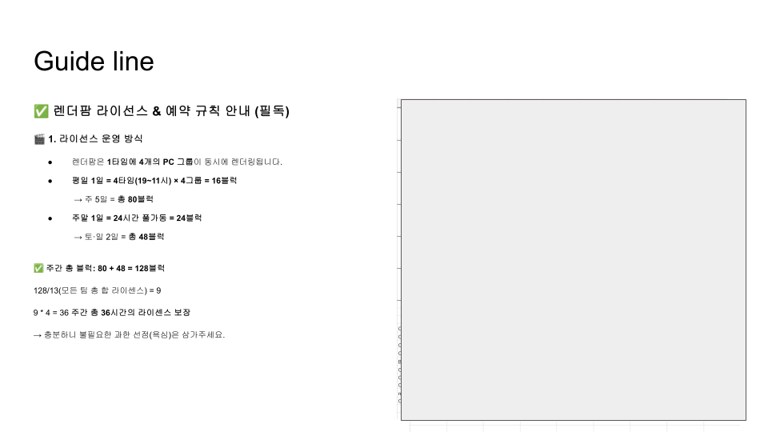
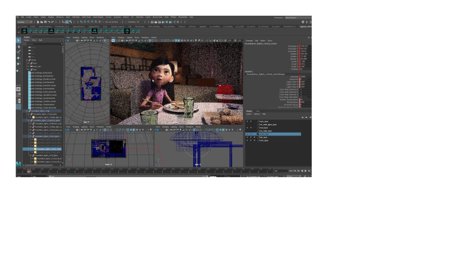
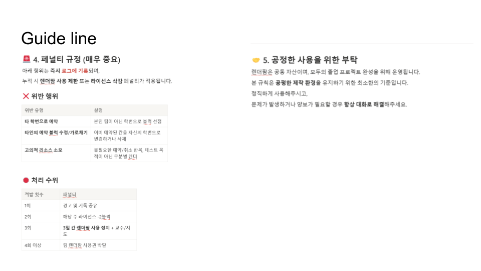
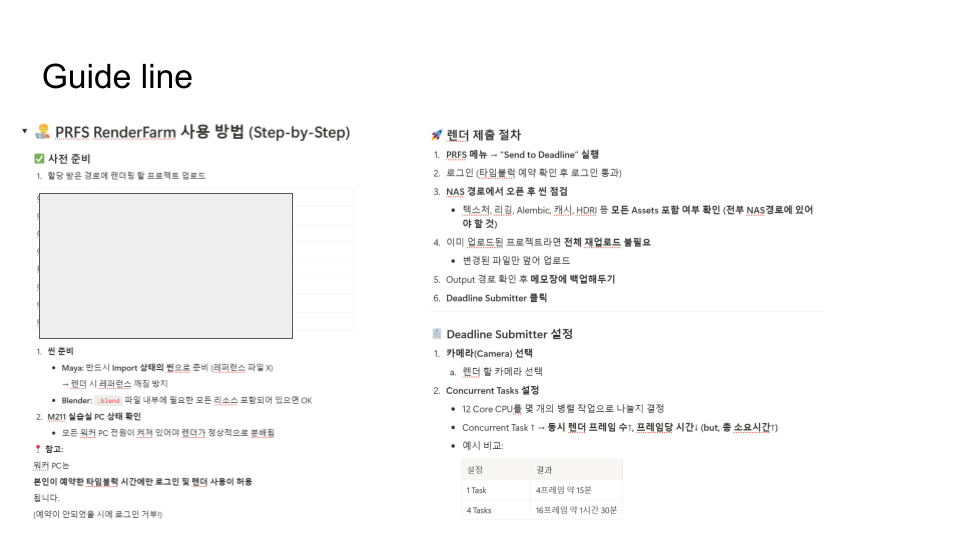
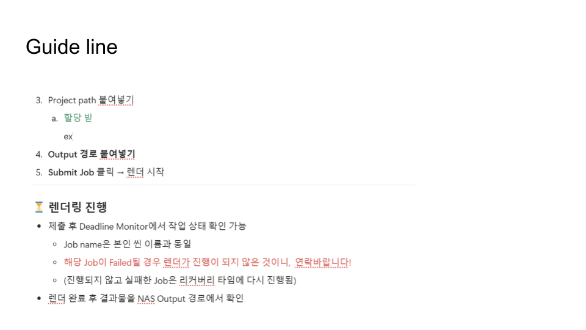
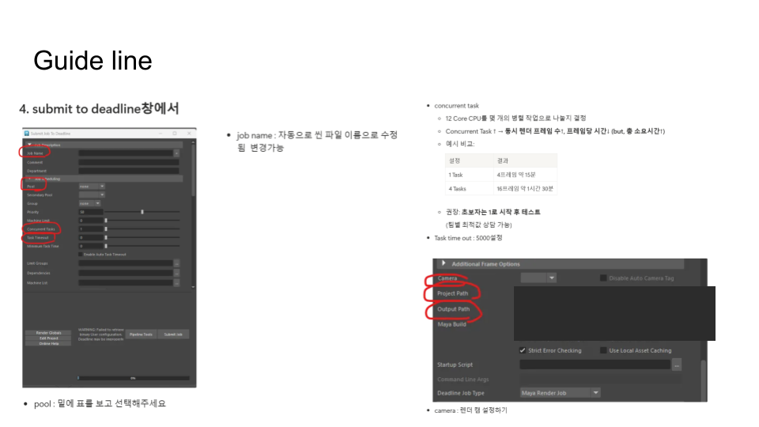
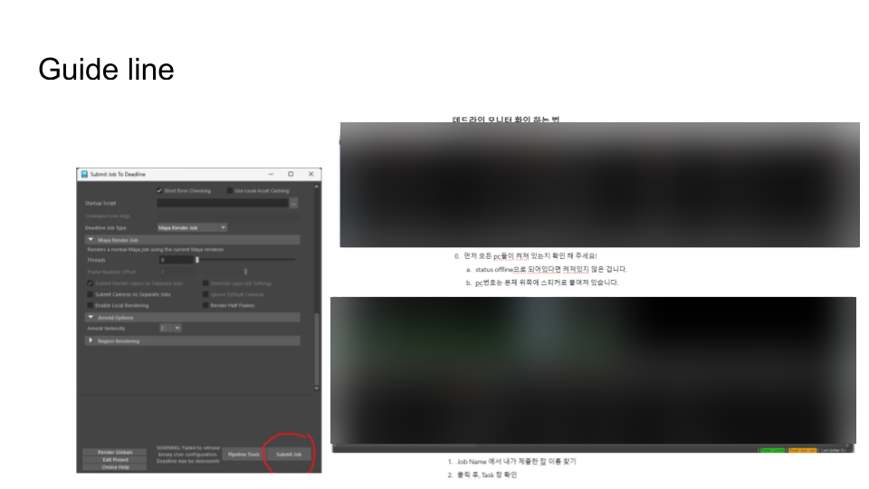
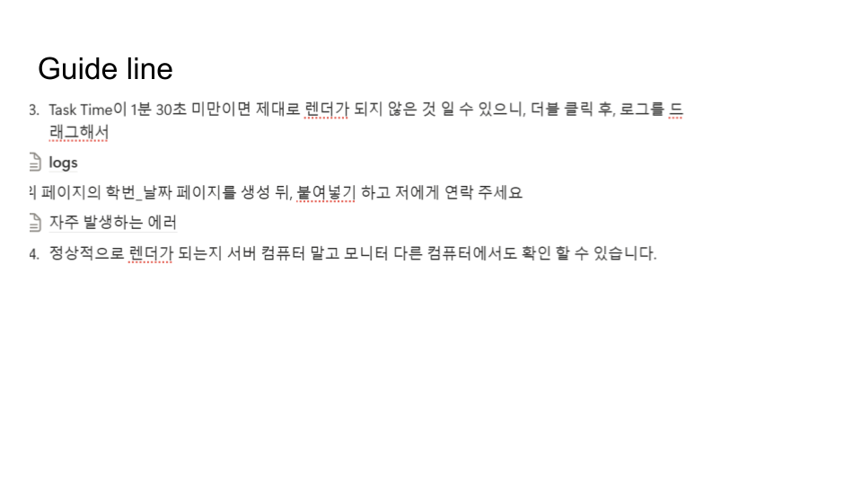
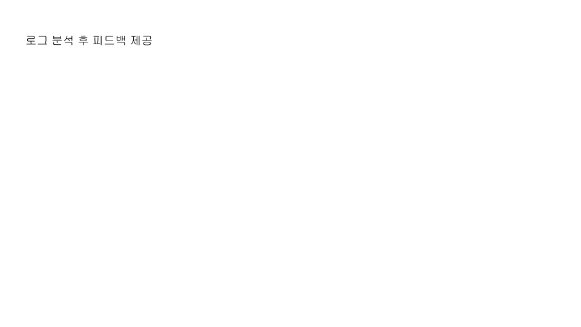

# Render Farm Usage Guide Screenshots

This folder contains redacted screenshots for the render farm usage guide.

## Screenshot Order

1. 
2. 
3. 
4. 
5. 
6. 
7. 
8. 
9. 
10. 

Checklist before upload:

- No real IP addresses.
- No real NAS/UNC paths.
- No usernames, student IDs, account names, or email addresses.
- No license server values.
- No Google Sheet URLs.
- No MongoDB URI or credential path.
- No raw Deadline logs with internal machine names.

Use this folder for screenshots that explain how a user submits a render job, not for private operation logs.
