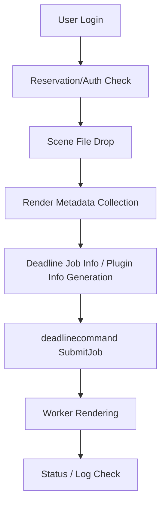

# Source Code Overview

This folder is the core public source snapshot for the Deadline Render Farm Automation project.

> Note: `src/` is a public portfolio snapshot reorganized for code review.
> The original development structure is preserved under `gpclean/`.

It is organized for portfolio and interview review. It does not replace the original runtime structure under `gpclean/`. Some imports may still refer to the original package layout because the goal is to make the main code areas easy to review without risky refactoring.

## Review Mode vs Runtime Mode

- Review Mode: use `src/` to inspect the main code areas for portfolio/interview review.
- Runtime Mode: the original executable project structure remains under `gpclean/`.
- Some imports may still reference the original package layout because `src/` was reorganized for safe code review, not as a risky full refactor.

## Folder Structure

- `ui/`: PySide-based login UI, file drop UI, and render submission UI
- `submission/`: Deadline job/plugin info generation and `deadlinecommand SubmitJob` submission logic
- `reservation/`: MongoDB-based user authentication, reservation, and status data access
- `config/`: Environment-based configuration placeholders
- `app_entry/original_main.py`: Copied original application entry point for reference
- `main.py`: Review-friendly entry point that summarizes the whole system flow

## UI Files

The `.ui` files in `src/ui/` are Qt Designer layout files. They define widget layout and are loaded by the Python controller/view code at runtime.

The matching Python files handle logic such as login signals, file drop behavior, submission screen state, and communication with reservation/auth or submission layers.

## Main Flow



Text version:

```text
User Login
-> Reservation/Auth Check
-> Scene File Drop
-> Render Metadata Collection
-> Deadline Job Info / Plugin Info Generation
-> deadlinecommand SubmitJob
-> Worker Rendering
-> Status / Log Check
```

## Notes

- This is a public portfolio snapshot.
- Internal paths, IPs, credentials, and private infrastructure details are removed or replaced with placeholders.
- Original development files are kept in `gpclean/` for project history.
- The original source layout is preserved separately to avoid breaking existing imports or runtime behavior.
